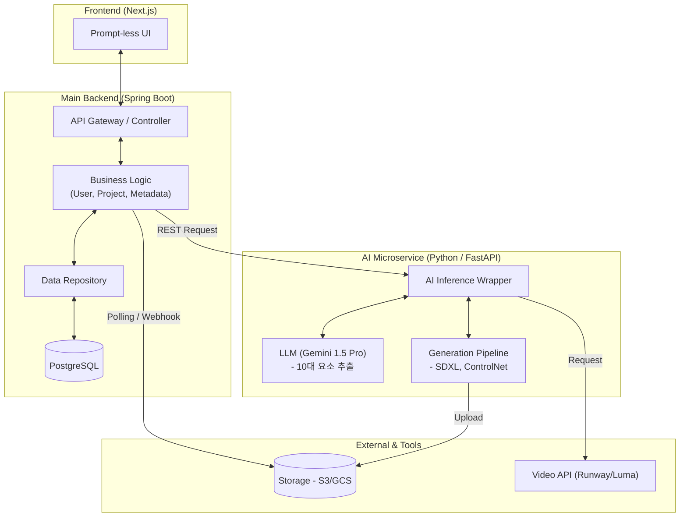

# 🏗️ r가중치 시스템 아키텍처 설계 (v2.0)

Spring Boot와 Python을 결합한 하이브리드 아키텍처로, 안정적인 백엔드 서버와 유연한 AI 파이프라인을 동시에 구축합니다.

## 1. 전반적인 시스템 구조 (Hybrid Microservices)

## 2. 기술 스택 (Updated Tech Stack)

| 구분 | 추천 기술 | 사유 |
| :--- | :--- | :--- |
| **Frontend** | Next.js (App Router) | 고품질 UI 및 빠른 렌더링 |
| **Main Backend** | **Spring Boot (Java)** | 시스템 안정성, 확장성, 강력한 생태계 (사용자/데이터 관리) |
| **AI Service** | **Python (FastAPI)** | AI 모델(PyTorch, Diffusers) 및 LLM SDK 연동 최적화 |
| **Database** | PostgreSQL | 데이터 정합성 유지 및 복잡한 관계형 데이터 처리 |
| **Storage** | AWS S3 / GCS | 에셋(이미지, 영상) 중앙 저장소 |
| **Communication** | REST API | Spring Boot와 Python 간의 가장 보편적이고 빠른 연동 방식 |

## 3. 서비스별 역할 분담 (Separation of Concerns)

### Spring Boot (Main Backend)
- **사용자 관리:** 회원가입, 로그인, 권한 제어.
- **데이터 관리:** 프로젝트 정보, 컷씬의 설정값(10대 요소) DB 저장 및 조회.
- **워크플로우 제어:** 컷씬 기획 요청을 Python 서비스에 전달하고, 생성된 에셋의 URL을 클라이언트에 제공.
- **파일 호스팅:** S3와 연동하여 최종 결과물 제공.

### Python (AI Microservice)
- **LLM 오케스트레이션:** Gemini 등을 호출하여 자연어 아이디어를 10대 요소(JSON)로 변환.
- **이미지 생성 제어:** Stable Diffusion, ControlNet 등 무거운 AI 라이브러리 직접 구동.
- **동영상 API 연동:** Runway 등 외부 API와의 복잡한 데이터 교환 처리.

## 4. 데이터 연동 흐름 (Inter-service Flow)

1. **Request:** 유저가 기획 요청을 보냄 (Next.js -> Spring Boot).
2. **Delegation:** Spring Boot가 필수 데이터를 담아 Python AI 서버에 기획 요청 (Spring Boot -> Python).
3. **AI Task:** Python 서버가 Gemini를 호출해 10대 요소를 뽑고, Spring Boot에 JSON 응답.
4. **Persist:** Spring Boot가 응답받은 데이터를 DB에 저장하고 성공 알림.
5. **Generate:** 유저가 영상 생성을 클릭하면, 위와 동일한 방식으로 Python 서버가 실제 비전 모델을 돌려 S3에 저장 후 완료 보고.
